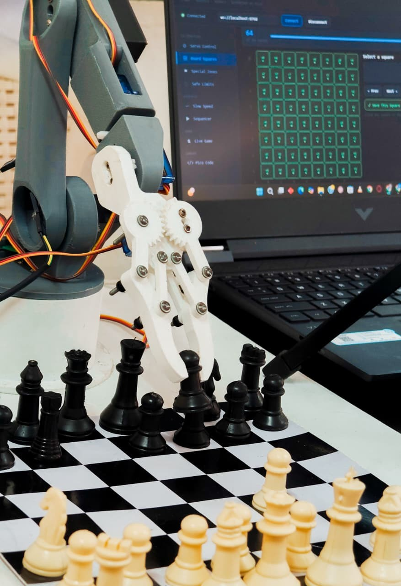
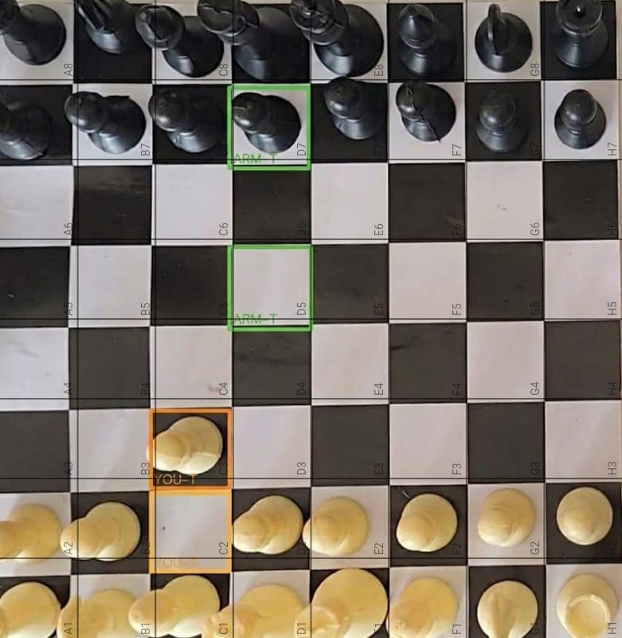
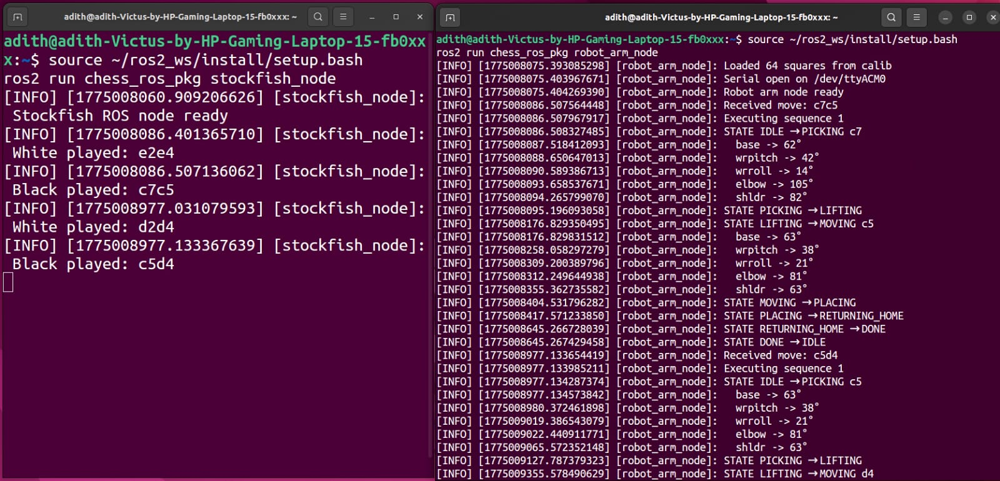
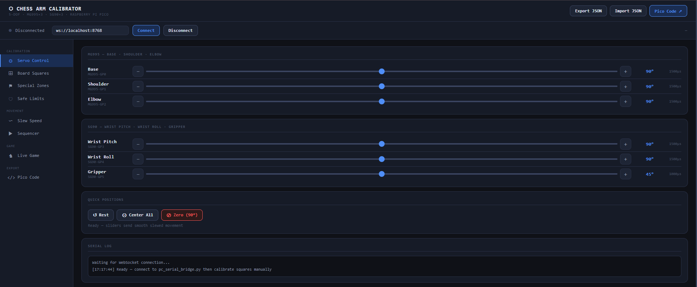
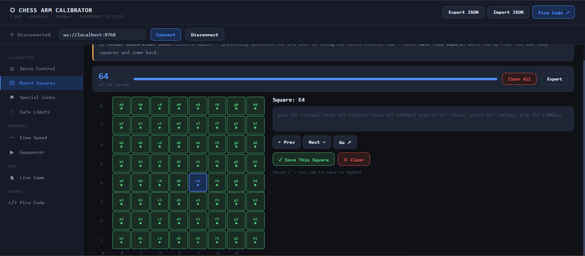
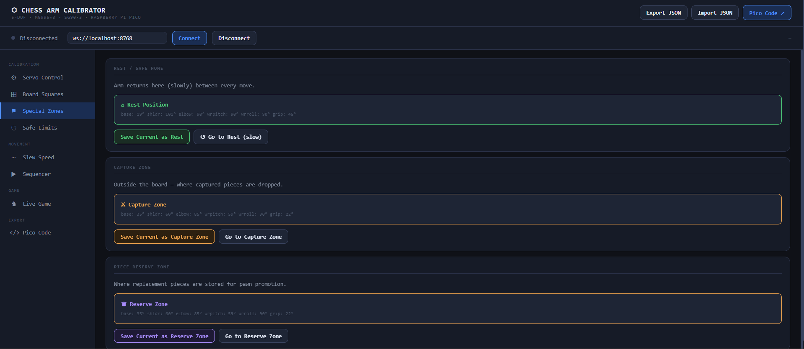
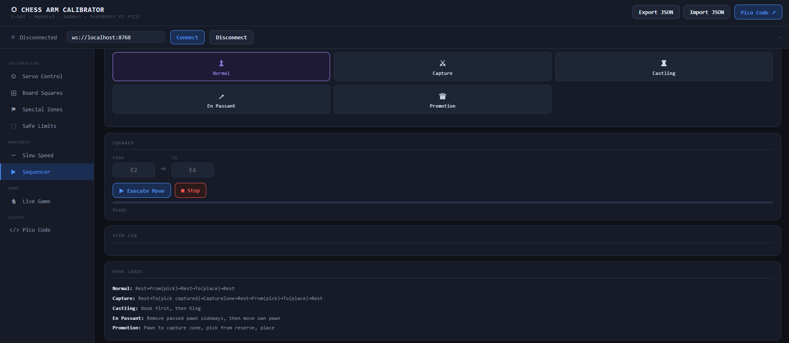

<div align="center">

# ♟️ Chess Robot Arm

### *ROS2-based real-time system for autonomous chess play using vision, engine decisions, and robotic control.*


<br/>



</div>

---

## 🧠 What is this?

A system that watches a real chess board, understands the move, and physically responds — all in real time.

### How it works

- 👁️ **Sees**  
  A fixed overhead camera detects moves using frame differencing (`cv2.absdiff`) over a calibrated 64-square grid.

- 🧠 **Understands**  
  Moves are validated using `python-chess`, then passed to Stockfish to compute the best response.

- 🦾 **Acts**  
  A state machine (`PICK → LIFT → MOVE → PLACE → HOME`) converts moves into calibrated servo actions via the Raspberry Pi Pico.

All components communicate through ROS2, forming a clean perception → decision → actuation pipeline.
---

## 🎬 Demo

**Vision system detecting your move and highlighting the arm's response:**



> 🟠 Orange = your move (YOU-T) &nbsp;|&nbsp; 🟢 Green = arm's response (ARM-F → ARM-T)

---

**Full ROS 2 pipeline firing in real time — Stockfish responding, arm executing:**



> Left: `stockfish_node` receiving white move → computing black response
> Right: `robot_arm_node` loading angles from JSON → slewing all 6 servos through the full state machine

---

## 🔄 The Journey — 3 Versions

This project didn't come out perfectly on the first try. Here's what actually happened:

```
V1 ──────────────────────────────────────────────────────────── V3
ROS 2 + YOLO              absdiff + WebSocket          ROS 2 + absdiff
      │                           │                           │
      │  YOLO failed on           │  WebSocket was            │  Clean. Reliable.
      │  inconsistent             │  flaky — browser          │  No browser.
      │  lighting                 │  had to stay open         │  No WebSocket.
      ▼                           ▼                           ▼
  Vision scrapped            Arm moves! ✅              Full pipeline ✅
  ROS arch kept ✅           absdiff kept ✅             Ships on Linux
```

| Version | Vision | Communication | Outcome |
|---|---|---|---|
| [V1 — ROS 2 Initial](v1_ros2_initial/) | YOLO | ROS 2 topics | ⚠️ Vision abandoned — lighting too inconsistent |
| [V2 — Working System](v2_working/) | absdiff | WebSocket + HTML | ✅ Arm physically moves pieces |
| [V3 — ROS 2 Final](v3_ros2_final/) | absdiff | ROS 2 topics | ✅ Full clean pipeline on Linux |

The `stockfish_node.py` written in V1 was **never changed** — it was right from the start. The state machine concept from V1's `robot_arm_node.py` carried all the way to V3, just extended with real hardware integration.

---

## 🔧 Calibration Tool

Before the arm could play a single game, every one of the **64 squares** had to be manually calibrated. We built a custom browser-based calibration tool from scratch — one of the most critical engineering decisions of the project.

### How it worked

```
1. Open chess_arm_calibrator.html in browser
2. Connect to pc_serial_bridge.py via WebSocket
3. Click a square on the 8×8 grid (e.g. E4)
4. Use servo sliders → arm moves in real time
5. Physically position arm over that square
6. Click "Save This Square" → angles written to JSON
7. Repeat for all 64 squares + special zones
8. Export JSON → used by arm executor forever after
```

### Tool Features

| Tab | What it does |
|---|---|
| **Servo Control** | Individual slider for each of 6 servos with live PWM readout |
| **Board Squares** | 8×8 clickable grid — green dot = calibrated, progress bar shows completion |
| **Special Zones** | Rest position, capture drop zone, pawn promotion reserve |
| **Safe Limits** | Min/max angle per servo — prevents mechanical damage from bad values |
| **Slew Speed** | ms-per-degree speed for each servo — tune smoothness vs. time |
| **Sequencer** | Test full move sequences: Normal, Capture, Castling, En Passant, Promotion |

---

**Servo Control — 6 sliders, live PWM feedback for all joints**


---

**Board Squares — all 64 squares calibrated, progress tracked**


---

**Special Zones — Rest position, Capture zone, Promotion reserve**


---

**Sequencer — test every move type before going live**


---

> The calibration data is exported as `chess_arm_calib.json` — a portable file the ROS arm node reads directly. No recalibration needed between sessions.

---

### System Overview

A real-time pipeline where vision detects a move, a chess engine computes the response, and a robotic arm executes it through a calibrated state machine.

## ⚡ System Pipeline (V3)

```
 ┌──────────────┐     HTTP      ┌──────────────────────┐
 │ 📱 IP Webcam │ ────────────▶│   chess_vision.py    │
 └──────────────┘               │                      │
                                │  cv2.absdiff detect  │
                                │  64-square grid diff │
                                │  detect: e2 → e4     │
                                └──────────┬───────────┘
                                           │ /white_move
                                           ▼
                                ┌──────────────────────┐
                                │   stockfish_node     │  ROS 2 Node
                                │                      │
                                │  python-chess valid  │
                                │  Stockfish UCI call  │
                                │  reply:   c7 → c5    │
                                └──────────┬───────────┘
                                           │ /black_move
                                           ▼
                                ┌──────────────────────┐
                                │   robot_arm_node     │  ROS 2 Node
                                │                      │
                                │  loads calib JSON    │
                                │  PICK→LIFT→MOVE      │
                                │  →PLACE→HOME         │
                                │  slews each servo    │
                                └──────────┬───────────┘
                                           │ S<pin>:<pulse_us>
                                           ▼
                                ┌──────────────────────┐
                                │  Raspberry Pi Pico   │
                                │  50Hz PWM output     │
                                │  500–2500µs range    │
                                └──────────┬───────────┘
                                           │
                                           ▼
                                     🦾 Arm moves
```

---

## ⚠️ Engineering Challenges

- **Reliable move detection under real-world conditions**  
  Initial YOLO-based approach failed due to lighting variability. Switched to a deterministic frame differencing method with a fixed camera and calibrated grid.

- **Electrical reliability & hardware failures**  
  Faced ground leakage issues that damaged an Arduino and stressed multiple high-torque servos. Required careful power isolation and stable supply selection beyond standard lab adapters.

- **Mechanical limitations under load**  
  Larger servos experienced gear slipping and instability under load, requiring adjustments in motion strategy and load distribution.

- **Precise motion tuning**  
  Determining optimal slew speeds (ms/°) for each servo was critical to balance speed, smoothness, and mechanical safety.

- **Collision-free movement planning**  
  Sequential motion planning was required to avoid knocking over adjacent chess pieces during pick-and-place operations.

- **Mapping board state to physical coordinates**  
  Required manual calibration of all 64 squares and special zones, stored as reusable JSON data.

- **System synchronization**  
  Ensuring correct sequencing between vision detection, move validation (`python-chess`), and execution to prevent invalid or duplicate moves.

- **System decoupling and communication**  
  Used ROS2 pub/sub to isolate perception, decision, and control modules, avoiding tight coupling across the system.

  ---

## 🛠️ Hardware

```
5-DOF Robotic Arm
├── Base          MG995  (GP0) ── 360° rotation
├── Shoulder      MG995  (GP1) ── main reach
├── Elbow         MG995  (GP2) ── fine positioning
├── Wrist Pitch   SG90   (GP3) ── approach angle
├── Wrist Roll    SG90   (GP4) ── gripper orientation
└── Gripper       SG90   (GP5) ── open/close

Microcontroller : Raspberry Pi Pico
Protocol        : USB Serial @ 115200 baud
Command format  : S<pin>:<pulse_us>  e.g. S0:1500
PWM frequency   : 50Hz (standard hobby servo)
Pulse range     : 500µs (0°) → 2500µs (180°)

Camera          : Android phone running IP Webcam app
                  Overhead fixed mount — deterministic ROI
```

---

## 🗂️ Repository Structure

```
chess-robot-arm/
│
├── 📄 README.md
│
├── 🎬 demo/                         ← all media
│   ├── arm.jpg                      ← hero photo
│   ├── vision_output.png            ← vision detection screenshot
│   ├── ros_pipeline.png             ← ROS terminals screenshot
│   ├── calib_servo_control.png      ← calibration tool screenshots
│   ├── calib_board_squares.png
│   ├── calib_special_zones.png
│   ├── calib_sequencer.png
│   └── demo.mp4                     ← arm moving video
│
├── 📁 v1_ros2_initial/              ← Version 1: ROS 2 + YOLO
│   └── chess_ros_pkg/
│       ├── stockfish_node.py        ← ✅ still used in V3 unchanged
│       ├── robot_arm_node.py        ← mock state machine
│       └── bridge_node.py
│
├── 📁 v2_working/                   ← Version 2: first working system
│   ├── chess_vision.py              ← absdiff + WebSocket
│   ├── pc_serial_bridge.py          ← WebSocket hub
│   ├── chess_arm_calibrator.html    ← custom calibration tool
│   ├── chess_arm_calib.json         ← 64-square calibration data
│   └── pico_servo_listener.py       ← Pico firmware
│
├── 📁 v3_ros2_final/                ← Version 3: final system
│   ├── chess_vision.py              ← absdiff + ROS 2 publisher
│   ├── chess_arm_calib.json         ← same calibration, reused
│   ├── pico_servo_listener.py       ← same Pico firmware
│   └── chess_ros_pkg/
│       ├── stockfish_node.py        ← unchanged from V1
│       └── robot_arm_node.py        ← JSON + serial + state machine
│
└── 📁 docs/
    └── architecture.md
```

---

## 🚀 Quick Start (V3)

```bash
# Clone
git clone https://github.com/Adi-gyt/chess-robot-arm.git
cd chess-robot-arm

# Install Python dependencies
pip install opencv-python numpy chess requests pyserial

# Install system dependencies
sudo apt install stockfish ros-humble-desktop

# Build ROS 2 package
cp -r v3_ros2_final/chess_ros_pkg ~/ros2_ws/src/
cd ~/ros2_ws && colcon build --packages-select chess_ros_pkg

# Copy calibration file
cp v3_ros2_final/chess_arm_calib.json ~/chess_arm_calib.json

# Terminal 1 — Stockfish node
source ~/ros2_ws/install/setup.bash
ros2 run chess_ros_pkg stockfish_node

# Terminal 2 — Arm node
source ~/ros2_ws/install/setup.bash
ros2 run chess_ros_pkg robot_arm_node

# Terminal 3 — Vision
source ~/ros2_ws/install/setup.bash
python3 v3_ros2_final/chess_vision.py

# Manual test — no camera needed
ros2 topic pub --once /white_move std_msgs/msg/String "{data: 'e2e4'}"
```

---

## 📐 Calibration Data Format

Every square stores 6 servo angles:

```json
"e2": { "base":80, "shldr":38, "elbow":45, "wrpitch":36, "wrroll":18, "grip":5 },
"e4": { "base":81, "shldr":54, "elbow":70, "wrpitch":33, "wrroll":18, "grip":5 }
```

Special zones:
```json
"zones": {
  "rest":    { "base":143, "shldr":110, "elbow":124, "wrpitch":90, "wrroll":17, "grip":5 },
  "capture": { "base":153, "shldr":95,  "elbow":112, "wrpitch":46, "wrroll":17, "grip":5 }
}
```

Slew speeds (ms per degree — controls smoothness):
```json
"slew": { "base":40, "shldr":40, "elbow":40, "wrpitch":40, "wrroll":40, "grip":40 }
```

---

## 🔑 Engineering Highlights

| Concept | Implementation |
|---|---|
| Deterministic vision | Fixed camera + fixed ROI → `cv2.absdiff` works every time |
| Decoupled architecture | ROS 2 pub/sub — nodes never call each other directly |
| Safety-first design | No move executes without `python-chess` legal move validation |
| State machine | `IDLE→PICK→LIFT→MOVE→PLACE→HOME` with error handling at every step |
| Smooth servo control | Degree-by-degree slewing at configurable ms/° — no jerking |
| Portable calibration | JSON export/import — calibrate once, use forever |
| Custom tooling | Built a full browser calibration app rather than hardcoding values |

---

## 🎥 Demo Video

Watch the robotic arm executing a move:

👉 https://github.com/Adi-gyt/chess-robot-arm/raw/main/demo/demo.mp4

> Note: Gripper calibration was still in progress during this recording — full pick-and-place is more refined in the current system.

---

## 🧾 One Line

> *A modular chess-playing robotic system — vision detects, Stockfish decides, ROS 2 coordinates, the arm executes.*

---

<div align="center">

Made with frustration, iteration, and too much coffee ☕

**[⭐ Star this repo](https://github.com/Adi-gyt/chess-robot-arm)** if you find it interesting!

</div>
