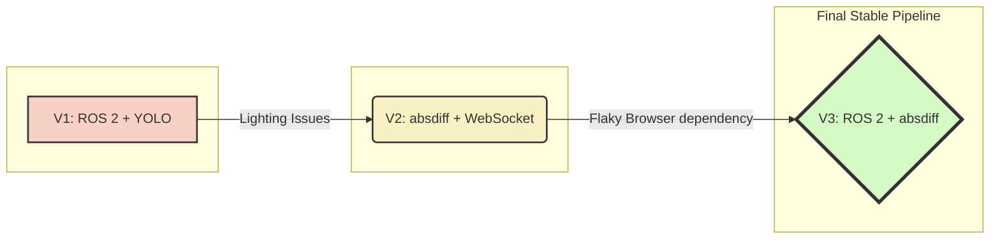
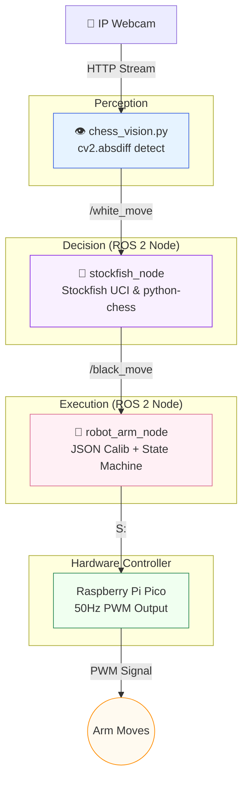

<div align="center">

# ♟️ VYUHA 2.0 - Chess Robotic Arm

### *ROS2-based real-time system for autonomous chess play using vision, engine decisions, and robotic control.*


<br/>


</div>

---

## 📌 Executive Summary
**VYUHA 2.0** is an intelligent, physical chess-playing robot. Unlike digital-only engines, this system observes a real, physical board using an overhead camera, understands the game state using OpenCV, computes its next move using the powerful Stockfish engine, and physically executes its strategy using a 5-DOF robotic arm driven by a Raspberry Pi Pico—all orchestrated smoothly via a decoupled ROS 2 architecture.

---

## 🧠 What is this?

A system that watches a real chess board, understands the move, and physically responds — all in real time.

### How it works

- 👁️ **Sees**  
  A fixed overhead camera detects moves using frame differencing (`cv2.absdiff`) over a calibrated 64-square grid.

- 🧠 **Understands**  
  Moves are validated using `python-chess`, then passed to Stockfish to compute the best response.

- 🦾 **Acts**  
  A state machine (`PICK → LIFT → MOVE → PLACE → HOME`) converts moves into calibrated servo actions via the Raspberry Pi Pico.

All components communicate through ROS 2, forming a clean perception → decision → actuation pipeline.

---

## 🎬 Demo

### Live Execution
Watch VYUHA 2.0 in action executing a move dynamically:
<br/>
https://github.com/njanorupavam/VYUHA-2.0-chess-robotic-arm-/raw/main/demo/demo.mp4

*(Note: Gripper calibration was still in progress during this recording — full pick-and-place is more refined in the current system.)*

---

### Vision System & Node Pipeline
**Vision system detecting your move and highlighting the arm's response:**

> 🟠 Orange = your move (YOU-T) &nbsp;|&nbsp; 🟢 Green = arm's response (ARM-F → ARM-T)

**Full ROS 2 pipeline firing in real time — Stockfish responding, arm executing:**

> Left: `stockfish_node` receiving white move → computing black response
> Right: `robot_arm_node` loading angles from JSON → slewing all 6 servos through the full state machine

---

## 🔄 The Journey — Architectural Evolution

This project underwent significant iteration to reach its current robustness. Here's how the architecture evolved:



| Version | Vision | Communication | Outcome |
|---|---|---|---|
| [V1 — ROS 2 Initial](v1_ros2_initial/) | YOLO | ROS 2 topics | ⚠️ Vision abandoned — lighting too inconsistent |
| [V2 — Working System](v2_working/) | absdiff | WebSocket + HTML | ✅ Arm physically moves pieces |
| [V3 — ROS 2 Final](v3_ros2_final/) | absdiff | ROS 2 topics | ✅ Full clean pipeline on Linux |

---

## ⚡ System Pipeline (V3)

The architecture emphasizes modularity through decoupled ROS 2 nodes:



---

## ⚠️ Engineering Challenges

Bringing this hardware-software integration to life was a massive engineering challenge:

> [!WARNING]
> **Electrical & Mechanical Stress**  
> We faced ground leakage issues that damaged an Arduino and stressed high-torque servos. We solved this with careful power isolation and selecting stable, heavy-duty power supplies. We also tuned slew speeds (ms/°) for each servo to prevent gear slipping and maintain stability under load.

> [!IMPORTANT]
> **Vision Reliability (YOLO vs absdiff)**  
> Initial YOLO-based piece detection failed due to lighting variability. We pivoted to a much more deterministic frame differencing method (`cv2.absdiff`) with a fixed overhead camera and calibrated grid, achieving near 100% detection reliability.

> [!NOTE]
> **Collision-Free Path Planning**  
> Physical chess pieces get in the way! We implemented sequential motion planning to avoid knocking over adjacent pieces during complex pick-and-place maneuvers.

> [!TIP]
> **Decoupled Architecture**  
> By utilizing a ROS 2 pub/sub model, the perception, decision, and control modules were isolated. If the vision node fails, the robot node safely idles.

---

## 🔧 Calibration Tool

Before the arm could play a single game, every one of the **64 squares** had to be manually calibrated. We built a custom browser-based calibration tool from scratch.

### Tool Features
- **Servo Control**: Individual slider for each of 6 servos with live PWM readout.
- **Board Squares**: 8×8 clickable grid tracking completion.
- **Special Zones**: Rest position, capture drop zone, pawn promotion reserve.
- **Safe Limits**: Min/max angle per servo — prevents mechanical damage.
- **Slew Speed**: ms-per-degree speed for each servo to tune smoothness.
- **Sequencer**: Test full move sequences before going live.

*(Screenshots of the tool can be found in the `demo/` directory)*

---

## 🛠️ Hardware Specifications

```text
5-DOF Robotic Arm
├── Base          MG995  (GP0) ── 360° rotation
├── Shoulder      MG995  (GP1) ── main reach
├── Elbow         MG995  (GP2) ── fine positioning
├── Wrist Pitch   SG90   (GP3) ── approach angle
├── Wrist Roll    SG90   (GP4) ── gripper orientation
└── Gripper       SG90   (GP5) ── open/close

Microcontroller : Raspberry Pi Pico
Protocol        : USB Serial @ 115200 baud
PWM frequency   : 50Hz (standard hobby servo)
Pulse range     : 500µs (0°) → 2500µs (180°)
Camera          : Android phone running IP Webcam app
```

---

## 🚀 Quick Start (V3)

```bash
# Clone
git clone https://github.com/njanorupavam/VYUHA-2.0-chess-robotic-arm-.git
cd VYUHA-2.0-chess-robotic-arm-

# Install Python dependencies
pip install opencv-python numpy chess requests pyserial

# Install system dependencies
sudo apt install stockfish ros-humble-desktop

# Build ROS 2 package
cp -r v3_ros2_final/chess_ros_pkg ~/ros2_ws/src/
cd ~/ros2_ws && colcon build --packages-select chess_ros_pkg

# Copy calibration file
cp v3_ros2_final/chess_arm_calib.json ~/chess_arm_calib.json

# Terminal 1 — Stockfish node
source ~/ros2_ws/install/setup.bash
ros2 run chess_ros_pkg stockfish_node

# Terminal 2 — Arm node
source ~/ros2_ws/install/setup.bash
ros2 run chess_ros_pkg robot_arm_node

# Terminal 3 — Vision
source ~/ros2_ws/install/setup.bash
python3 v3_ros2_final/chess_vision.py

# Manual test — no camera needed
ros2 topic pub --once /white_move std_msgs/msg/String "{data: 'e2e4'}"
```

---

## 🔑 Engineering Highlights for the Panel

| Concept | Implementation |
|---|---|
| **Deterministic Vision** | Fixed camera + fixed ROI ensures `cv2.absdiff` works every time. |
| **Decoupled Architecture** | ROS 2 pub/sub — nodes never block each other directly. |
| **Safety-First Design** | No physical move executes without `python-chess` legal validation. |
| **State Machine Control** | `IDLE→PICK→LIFT→MOVE→PLACE→HOME` with resilient error handling. |
| **Custom Tooling** | Developed a full browser calibration app to avoid hardcoding values. |

---

## 🧾 One Line Summary

> *A modular chess-playing robotic system — vision detects, Stockfish decides, ROS 2 coordinates, the arm executes.*

---

<div align="center">

Made with frustration, iteration, and too much coffee ☕

**[⭐ Star this repo](https://github.com/njanorupavam/VYUHA-2.0-chess-robotic-arm-)** if you find it interesting!

</div>
